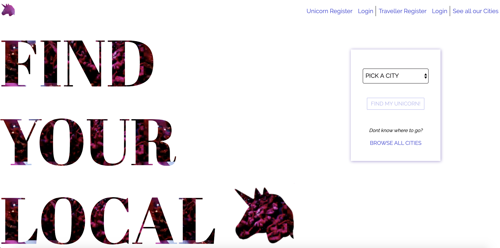

# GA Project 3 - Local Unicorn

Local Unicorn is a travel website to help travellers find unique tours provided by local guides (unicorns). Users can either register as a traveller and book tours or as a unicorn and provide tours. This was the third project I completed during the General Assembly Software Engineering Immersive (bootcamp) course.

## Built With

* HTML5
* SCSS
* Spectre CSS Framework
* Javascript
* React
* NoSQL (MongoDB)
* Node
* Express
* Insomnia
* Mocha / Chai Testing
* Git / GitHub

## Timeframe

1 Week team project with [Felicia Hjertman](https://github.com/feliciahj) and [Gerardo Siebels](https://github.com/gsiebels)

## Deployment

This website is deployed on [Heroku](https://local-unicorn.herokuapp.com)



---

## Getting Started

Use the clone button to download the source code. In your terminal enter the following commands:

### To install all the packages listed in the package.json:
$ yarn

### Run the app on your localhost:
$ yarn start

## To Use

- 
- 
- 

---

## User Experience

```js

```

---

## Architecture

---

## Future Improvements

This project was...

Advancements that could be made in the future to improve this website include:

- Inclusion of a 'live' booking system
- Chat functionality with your chosen unicorn
- Improved review system - percentage satisfaction and limiting reviews to travellers who had been on experience.
- Add ability to see previously taken tours in travellers profile.

## Author - Mary-Anne Triggs

Please visit my personal [portfolio](www.maryannetriggs.com)