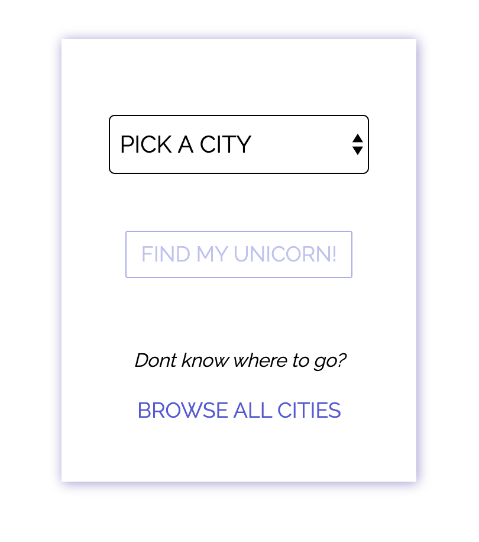
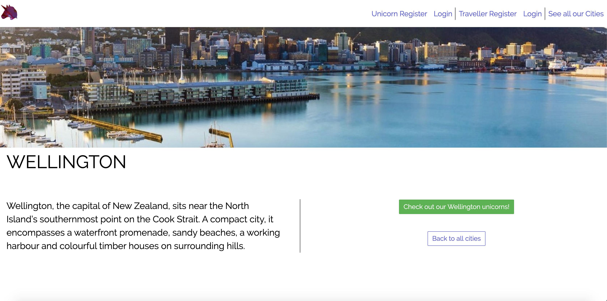
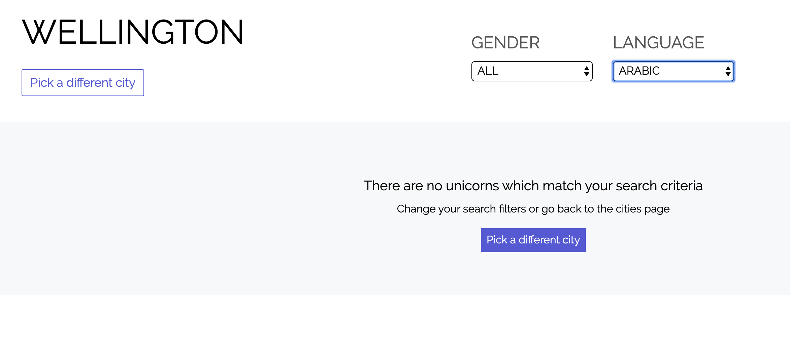
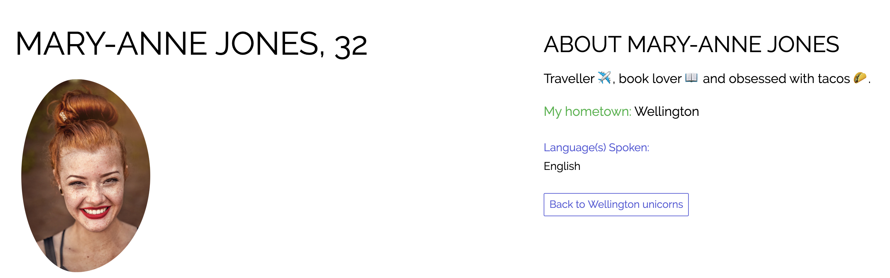
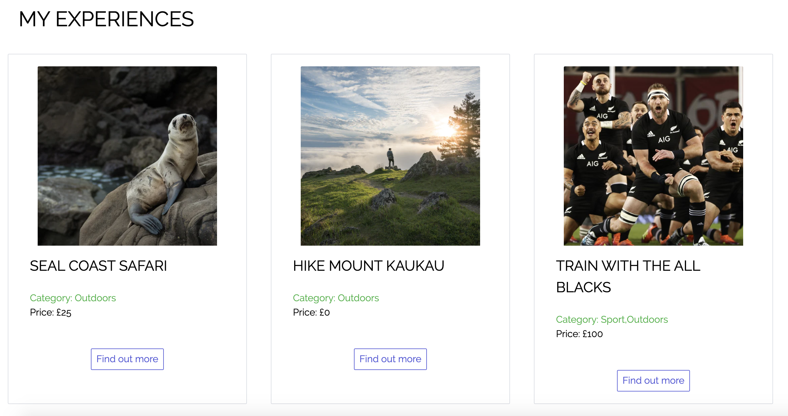
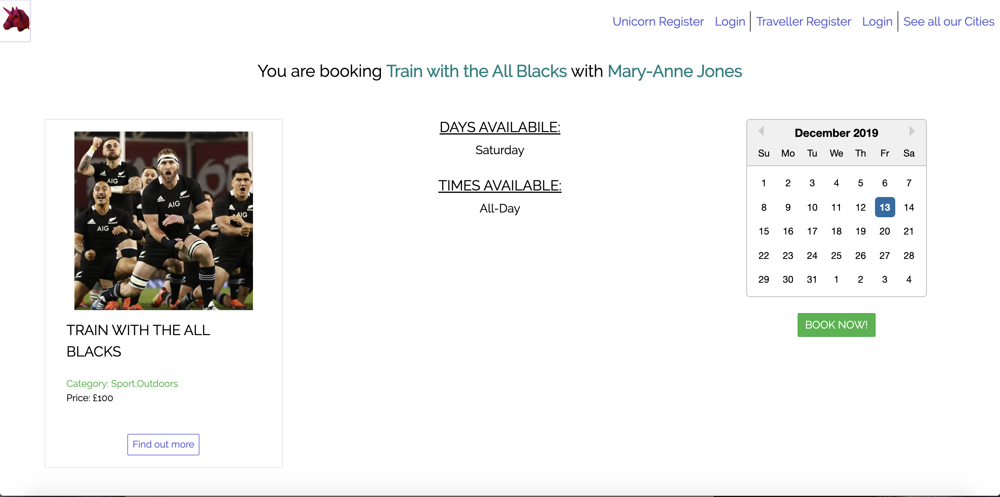
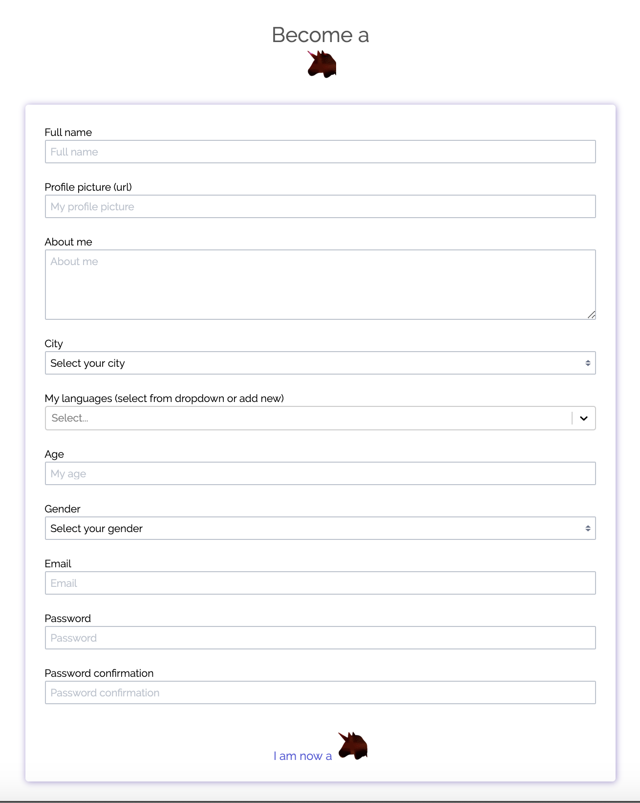
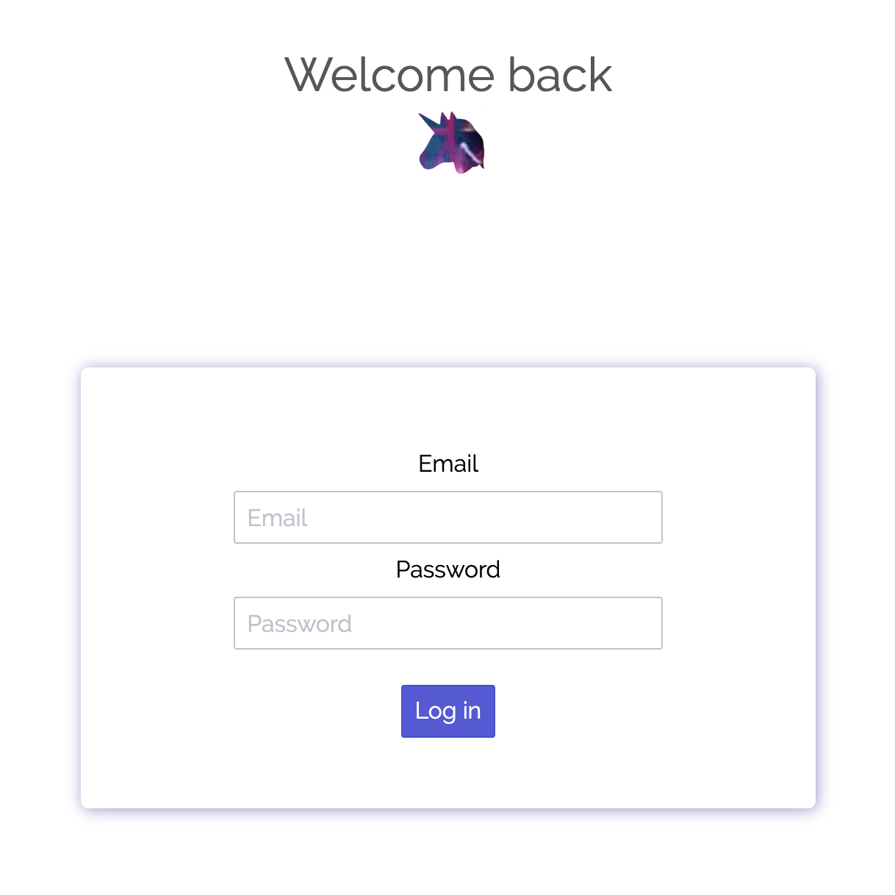

# GA Project 3 - Local Unicorn

Local Unicorn is a travel website to help travellers find unique tours provided by local guides (unicorns). Users can either register as a traveller and book tours or as a unicorn and provide tours. This was the third project I completed during the General Assembly Software Engineering Immersive (bootcamp) course.

## Built With

* HTML5
* SCSS
* Spectre CSS Framework
* JavaScript
* React
* NoSQL (MongoDB)
* Node
* Express
* Insomnia
* Yarn
* Mocha / Chai Testing
* Git / GitHub

## Timeframe

1 Week team project with [Felicia Hjertman](https://github.com/feliciahj) and [Gerardo Siebels](https://github.com/gsiebels)

## Deployment

This website is deployed on [Heroku](https://local-unicorn.herokuapp.com)


---

## Getting Started

Use the clone button to download the source code. In your terminal enter the following commands:

### To install all the packages listed in the package.json:
$ yarn

### Run the app on your localhost:
$ yarn start

---

## User Experience

There are many ways to navigate around the website to find your ideal tour. On the homepage you can begin searching by either chosing a city from a pre-defined list or chose to view all the available cities.



If you view all available cities you see the following


Any of the cities can be selected and user is taken to a show page for that city complete with a beautiful panoramic photograph and a paragraph giving a short introduction. From this page, users can chose to see the local guides (unicorns) in that city or go back a page to view all the cities again.



Unicorns are displayed in 'cards' with profile pictures, names, languages spoken and experiences offered. Unicorns can be filtered by gender and language spoken. If no unicorns match the required filter options an 'empty state' message is displayed.



Once a unicorn is selected, users are shown a profile of the unicorn and also the experiences they offer in 'cards'




Any of the experiences/tours can be selected and user is taken to a show page for that experience complete with a beautiful panoramic photograph, experience info (experience category, intensity, cost and availability) and a paragraph giving a short introduction. From this page, users can chose to book the experience or go back a page to view the unicorn again.



If a user clicks 'Book this experience!' they get the following page which shows the experience car once more, shows the booking availabily and a calendar with selectable date functionality. A date can be selected from the calendar and if the 'BOOK NOW' button is clicked the following page can be viewed.


Users/Travellers and Unicorns can register and log in to personal accounts (required to view personal profiles and to write experience reviews)




---

## Challenges

The challenges associated with this project were:

* Working remotely as a team on the same git branch
* Creating such a large project with so many routes and maintaining consistency across coding and design styles.
* Understanding React props

---

## Wins

The wins associated with this project were:

* Coding the JavaScript logic for filtering the Unicorns on the Unicorn show page taking into account the city selected from the home page

```js
filteredUnicorns() {
    const city = this.props.location.state.from
    const { gender, language } = this.state
    if (!this.state.unicorns) return null
    return this.state.unicorns.filter(unicorn => {
      return (unicorn.city.name === city) &&
        (unicorn.gender === gender || gender === 'All') &&
        (unicorn.language.includes(language) || language === 'All')
    })
  }
```
* Adding little UX features to improve the user experience whilst navigating the site such as:
  1. Disabling the button to search for unicorns in a city if a city hadn't been selected

```js
<Link className="btn btn-lg centre" disabled={!city} to={{ pathname: '/unicorns', state: { from: city } }}>
  FIND MY UNICORN!
</Link>
```

  2. using a ternary statement to determine if there were no unicorns to display after filtering options had been applied and displaying an empty state message if this was the case

```js
{this.filteredUnicorns().length === 0
          ?
          <div className="empty emptyDiv">
            <div className="empty-icon">
              <i className="icon icon-people"></i>
            </div>
            <p className="empty-title h5">There are no unicorns which match your search criteria</p>
            <p className="empty-subtitle">Change your search filters or go back to the cities page</p>
            <div className="empty-action">
              <Link to="/cities">
                <button className="btn btn-primary">Pick a different city</button>
              </Link>
            </div>
          </div>
          :

          <>
            <div className="container">
              <div className="columns">
                {this.filteredUnicorns().map(unicorn => (
                  <UnicornCard key={unicorn._id} {...unicorn} />
                ))}
              </div>
            </div>
          </>
          
        }
```
 3. CSS styling to 'animate' the navigation bar options when the mouse was hovered over them

```scss
.nav-links {
  display: flex;

  a:hover {
    margin-bottom: 5px;
  }
}
```

* Having the immersive gif background on the home page

```css
.homeTitle {
background: url('https://media.giphy.com/media/l2YWALs1EJfoNaRK8/giphy.gif');
    -webkit-text-fill-color: transparent;
    background-clip: text;
    -webkit-background-clip: text;
    font-family: 'Abril Fatface', cursive;
    font-size: 220px;
    margin: 0;
  }
```

---

## Key Learning Points

The key learning points associated with this project were:

* CSS Frameworks are amazing for quick polished styling and snazzy extra features but overwriting pre-set styling is near-impossible
* The importance of appropriate naming of variables, components and CSS classes
* How to work on a coding project as part of a team

---

## Future Improvements

This project was a really fun experience and a good insight into how to code as part of a team. I believe we worked well together and acheived a beautiful, fun website whilst learning lots.

Advancements that could be made in the future to improve this website include:

- Inclusion of a 'live' booking system
- Chat functionality with your chosen unicorn
- Improved review system (including - percentage satisfaction and limiting reviews to travellers who had been on experience)

## Author - Mary-Anne Triggs

Please visit my personal [portfolio](www.maryannetriggs.com)